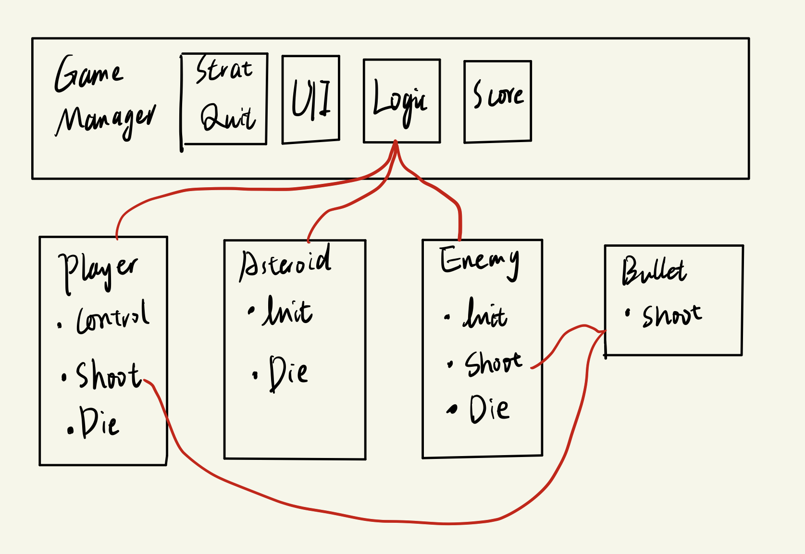
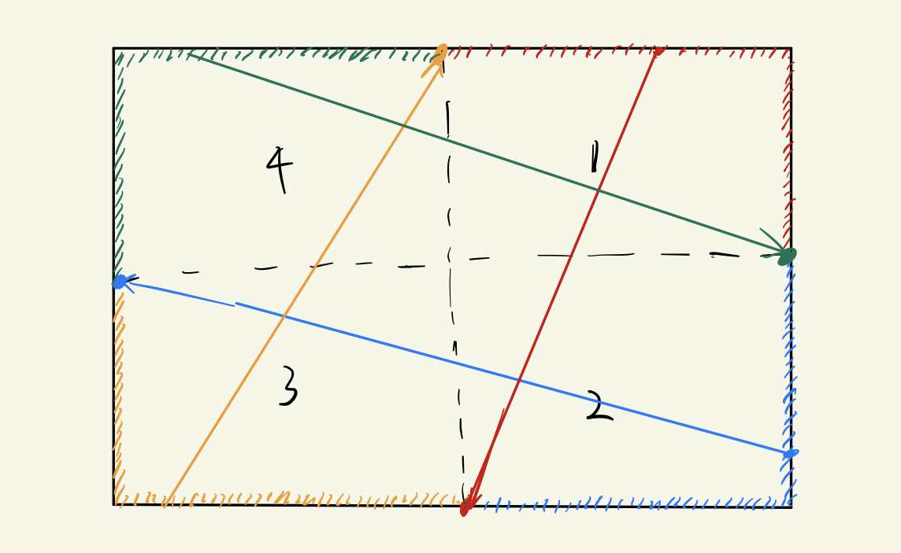
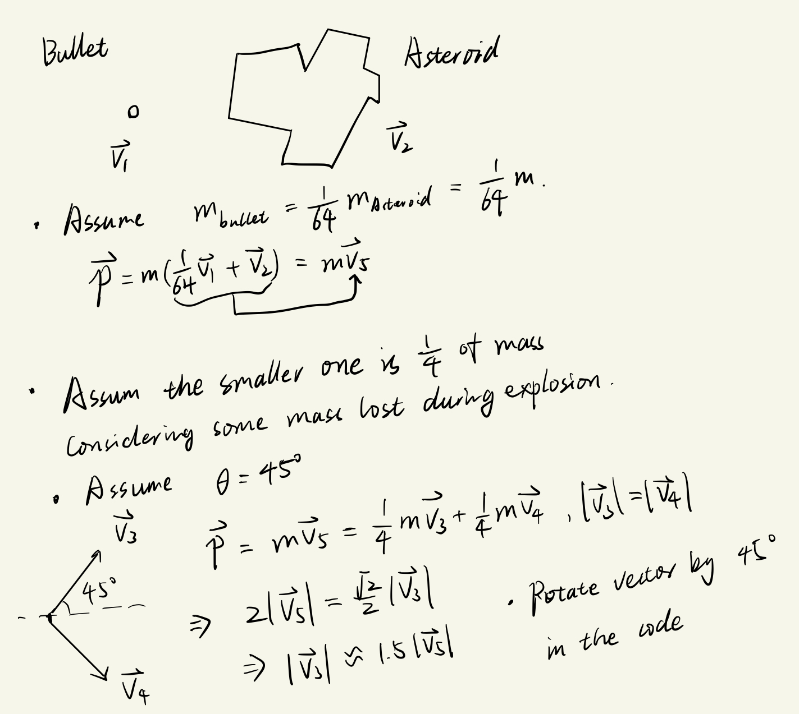

# AsteroidsChallenge

Rovio code challenge for Game Developer Position

## Introduction

This project is my version of the famous arcade game Asteroids. After reading some comments about the game, I can feel how it affects both players and the games developed later. Thus, I decided to make it as similar as possible. Since I have never played it myself, the game logic is based on the reference. 

Rules:
1. Player has 3 lives at the start, for every 10,000 scores, the player gets one more life (5 at maximum). The game will be over when the player loses all 3 lives.
2. Player loses lives when colliding with asteroids, enemies, and bullets shot from the enemy.
3. Asteroids have 3 sizes. Once an asteroid is destroyed, it will split into two smaller ones apart from the smallest one.
4. Asteroid score: Large - 20, Mid - 50, Small - 100.
5. New asteroid will spawn only after the player clears the last wave of asteroids
6. Enemy flight will spawn every period of time (40 seconds in the beginning).
7. With the score getting higher, the period gets shorter.
8. After the score reaches 40,000, there are no more asteroids, only enemy flights.
9. All the objects will be displayed within the screen, namely, if one goes out of the boundary, it will go back from the other side of the boundary.

Game assets resources (both image and sound, sorry for forgetting the specifics links):
1. [https://opengameart.org/](https://opengameart.org/)

References:
1. [https://freeasteroids.org/](https://freeasteroids.org/)
2. [https://en.wikipedia.org/wiki/Asteroids_(video_game)](https://en.wikipedia.org/wiki/Asteroids_(video_game))
3. [https://levelskip.com/classic/Asteroids-Game](https://levelskip.com/classic/Asteroids-Game)

This project has a web build, try to play the web version at [here: https://unchained112.github.io/AsteroidsWebBuild/](https://unchained112.github.io/AsteroidsWebBuild/)

The gameplay video showcase is [Google Drive link](https://drive.google.com/file/d/1fneMPGZY2wGJ4S84szZvvpkzJ7CcWCLO/view?usp=share_link), but I would suggest you try the web version.

Control: 
- "W/UpArrow" - thrusting
- "A/LeftArrow", "D/RightArrow" - turn left, right
- "Space" - shoot

*PS: Library folder is not submitted to the GitHub Repo*

## Structure Design

The structure design draft is shown in the image below, the overall implementation follows this. Some details might be different.

## Component Details

Game Manager (game object in the main scene):
- UI elements 
- Sound effects (PS: shoot sound is bound to player and enemy)
- Start the game by initializing all other objects
- Generate Asteroid wave after wave
- Spawn enemy every period of time
- Scoring when asteroids or enemies are destroyed
- Destroy all objects and display 

Player:
- Input control in `Update()`
- RigBody2D for physics
- Notice GM on destroyed

Asteroid:
- RigBody2D for physics
- Notice GM on destroyed

Enemy:
- Shoot bullets toward the player every period of time
- Move toward player every period of time
- RigBody2D for physics
- Notice GM on destroyed

Bullet:
- Being shot from the object's (player and enemy) position
- RigBody2D for physics
- Destroy itself after a collision or reaches its max lifetime

Others:
- Particle system for the explosion effect (bound to GM)
- Utility functions for wrap the position of game objects inside the screen.

## Problems Encountered

### Where and when to generate the asteroids?

From my observation of the [Asteroids play video](https://www.youtube.com/watch?v=WYSupJ5r2zo), generally, the asteroids spawn evenly from the boundary of the screen with an initial speed moving towards the inside screen. Asteroids are generated wave after wave, one wave has more than the last one, starting with 4. Thus, in this game, I set the rules as the following:
1. Screen is divided into 4 parts, each wave has an even number of asteroids that evenly come from those four parts. (if mod 4 is 2, they are distributed to any 2 parts).
2. Each asteroid randomly spawns along the boundary of the corresponding part.
3. The init speed direction is towards the midpoint on the opposite boundary.

Check the image below for how it works.

### How do asteroids split?

From the game video, there are 3 sizes of different asteroids. Each asteroid (not the smallest one) will split into two smaller ones after being destroyed by the bullet. I hope to make this process fit people's physics intuition, so I calculated their speed according to the Momentum Conservation with the following simplified derivation:

### How to notice the Game Manager when the game object is destroyed?

- I used C# `delegate` and `event` is used to achieve.
- In Asteroid, Enemy, and Bullet game objects, I had public event members that are triggered once the game object collided with others (with a certain tag). Those work as the publisher.
- The Game Manager subscribes to the publisher every time a game object is initialized. The unsubscription is done when `GameOver`, namely, the player lost all 3 lives.  

### How to spawn enemies every period of time?

- The Unity *coroutine* is used to allow enemies to spawn every period of time and allow enemies to shoot every period of time.
- The delayed function is `IEnumerator` and is started by `StartCoroutine`.

### What to expect?
- Currently, the player will spawn 2s later after death (as long as the player still has lived). However, it is not guaranteed that a player will be destroyed immediately after respawning. I haven't decided how to solve this.
- To make it playable on mobile devices on the website, more buttons could be added as input. Currently, the schedule for the implementation of this function remains uncertain.  